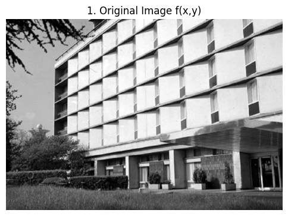
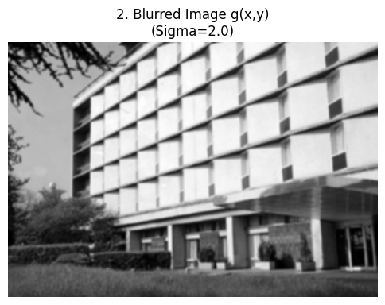
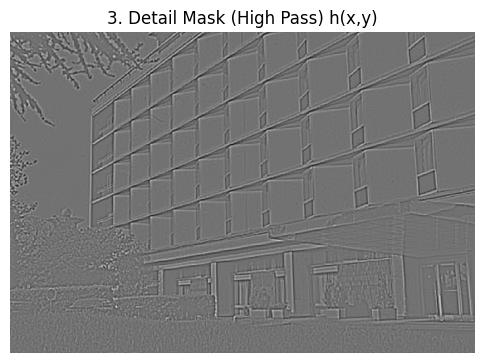
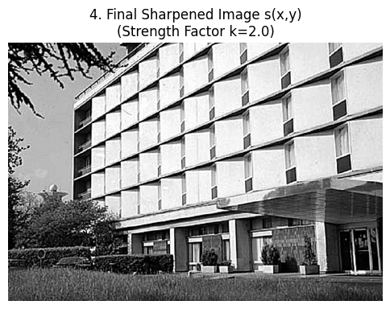
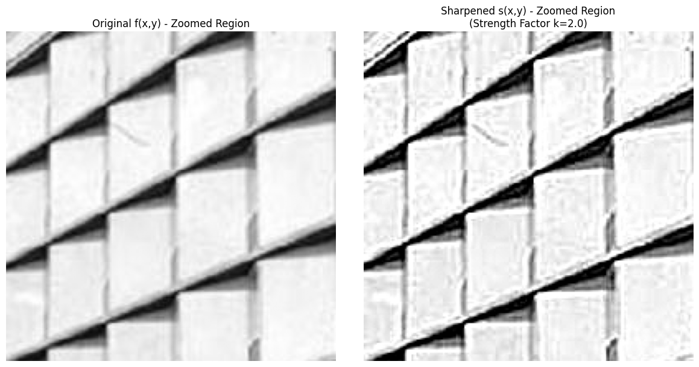

# Unsharp Masking Implementation

## Project Information

**Student Name:** Karim Wael Zaghloul Balbaa  
**Student ID:** 241482823  
**Lecturer:** Dr. Eman Gouda  
**Course:** Advanced Multimedia 

---

## Project Description

This project implements **Unsharp Masking**, an image enhancement technique used to sharpen images by amplifying high-frequency components. The implementation manually performs all steps of the unsharp masking algorithm and visualizes the intermediate results.

## Methodology

Unsharp masking is performed through the following steps:

1. **Original Image** $f(x,y)$: Load the input grayscale image
2. **Blurred Image** $g(x,y)$: Apply Gaussian blur (low-pass filter) to remove high-frequency details
3. **Detail Mask** $h(x,y)$: Calculate the difference between original and blurred images
   - Formula: $h(x,y) = f(x,y) - g(x,y)$
4. **Sharpened Image** $s(x,y)$: Add amplified details back to the original
   - Formula: $s(x,y) = f(x,y) + (k \times h(x,y))$
   - Where $k$ is the strength factor (set to 2.0 in this implementation)

## Implementation Details

- **Programming Language:** Python
- **Libraries Used:**
  - OpenCV (cv2) for image processing
  - NumPy for numerical operations
  - Matplotlib for visualization

- **Parameters:**
  - Gaussian kernel size: 9×9
  - Sigma value: 2.0
  - Sharpening strength factor (k): 2.0

## Results

The implementation generates four main images:

### Output Images

#### 1. Original Image $f(x,y)$
**Description:** The input grayscale image containing both low-frequency (smooth areas) and high-frequency components (edges, textures).



**Expected Output:**
- Clear building structure with visible brick textures
- Sharp edges on windows and scaffolding
- Mix of smooth sky areas and detailed building features

#### 2. Blurred Image $g(x,y)$
**Description:** The result after applying Gaussian blur (low-pass filter) with $\sigma = 2.0$.



**Expected Output:**
- Smooth, fuzzy appearance
- Fine textures of bricks are now smooth
- Sharp lines of the building are softened
- Overall image appears smoother with reduced detail

#### 3. Detail Mask (High Pass) $h(x,y)$
**Description:** The extracted high-frequency components calculated as $h(x,y) = f(x,y) - g(x,y)$.



**Expected Output:**
- Mostly gray background (zero values)
- "Ghostly" outlines of building edges clearly visible
- Bright areas where original was brighter than blurred
- Dark areas where original was darker than blurred
- Represents exactly what was lost during blurring

#### 4. Final Sharpened Image $s(x,y)$
**Description:** The final result after adding amplified details: $s(x,y) = f(x,y) + (k \times h(x,y))$ where $k = 2.0$.



**Expected Output:**
- Enhanced texture and edge definition
- Brickwork appears more "gritty" and pronounced compared to original
- Edges of windows are sharper and more defined
- Overall image appears crisper and more detailed
- Slight halos may appear around darkest edges (due to $k=2.0$)

#### 5. Side-by-Side Comparison (Zoomed Region)
**Description:** A cropped region (rows 100-300, columns 200-400) showing original vs. sharpened side-by-side.



**Expected Output:**
- Left panel: Original image zoomed region
- Right panel: Sharpened image zoomed region
- Clear visual comparison of the sharpening effect

### Observations

- The blurred image successfully removes fine textures and sharp edges
- The detail mask clearly shows the "ghostly" outlines of edges and textures that were removed
- The final sharpened image demonstrates enhanced texture and edge definition
- With $k=2.0$, slight halos may appear around edges, indicating aggressive sharpening

## How to Run

1. **Prerequisites:**
   ```bash
   pip install opencv-python numpy matplotlib
   ```

2. **Open the notebook:**
   - Open `UnSharp_Masking.ipynb` in Jupyter Notebook or Google Colab

3. **Run all cells:**
   - The notebook will automatically download a sample image
   - Execute all cells sequentially to see the results

4. **Alternative:** Use your own image by modifying the image path in the code

## Saving Output Images

To save the output images for documentation, you can modify the `unsharp_show_image` function or add the following code after each image display:

```python
# Save Original Image
cv2.imwrite('output_1_original_fxy.png', unsharp_original_fxy.astype(np.uint8))

# Save Blurred Image
cv2.imwrite('output_2_blurred_gxy.png', unsharp_blurred_gxy.astype(np.uint8))

# Save Detail Mask
cv2.imwrite('output_3_detail_mask_hxy.png', unsharp_mask_display.astype(np.uint8))

# Save Sharpened Image
cv2.imwrite('output_4_sharpened_sxy.png', unsharp_final_sxy.astype(np.uint8))
```

Or use matplotlib to save the displayed images:

```python
plt.savefig('output_image.png', bbox_inches='tight', dpi=150)
```

## File Structure

```
Advanced_Multimedia_Task/
├── README.md
├── UnSharp_Masking.ipynb
├── unsharp_input_image.jpg (downloaded automatically)
├── output_1_original_fxy.png
├── output_2_blurred_gxy.png
├── output_3_detail_mask_hxy.png
├── output_4_sharpened_sxy.png
└── output_5_comparison.png
```

## Notes

- The implementation uses float32 precision for accurate mathematical operations
- All images are normalized for proper display
- The code is designed to work in both local Jupyter environments and Google Colab

---

**Submitted by:** Karim Wael Zaghloul Balbaa (ID: 241482823)  
**Under the supervision of:** Dr. Eman Gouda
